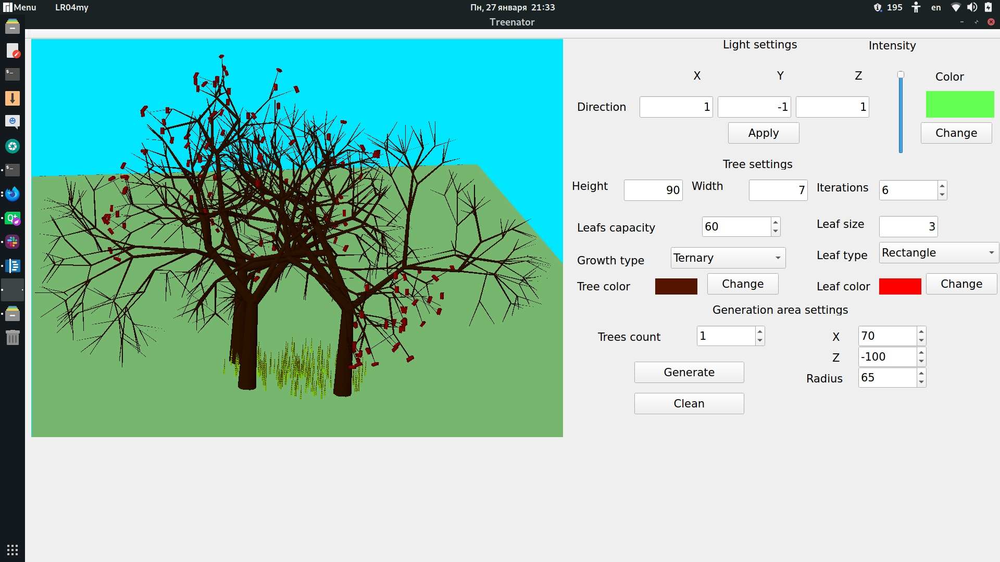
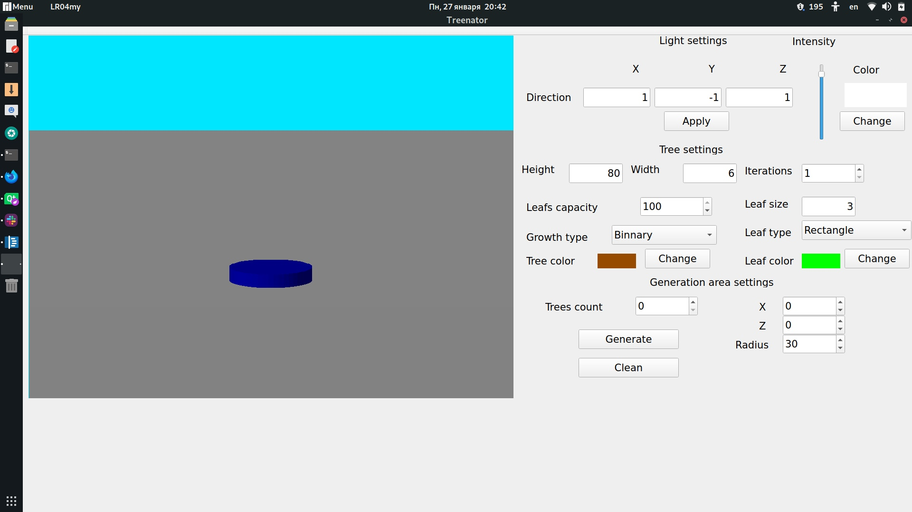
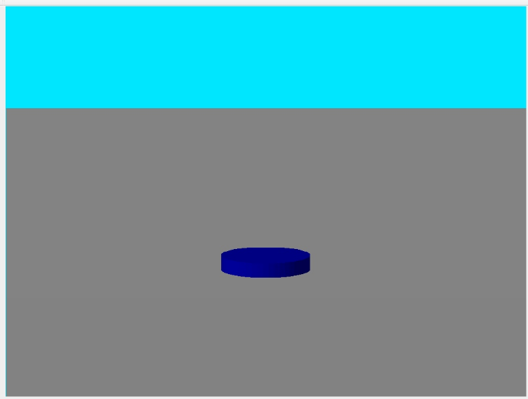
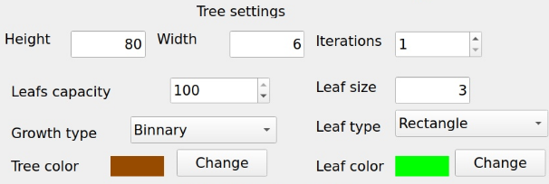
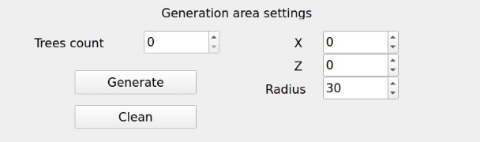
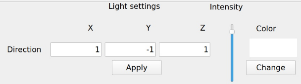
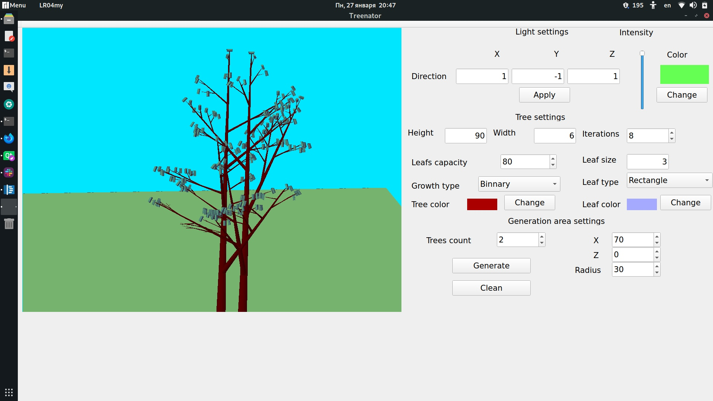

# Treenator
Treenator allows you to create randomly generated trees and view them from different points. This application was developed as a final project of Computer Graphics Cource in Bauman Moscow State Technical University Fall 2019.

# How to use it
Use QtCreator 5 to build project from source. 

## Interface

On this picture you can see initial interface of application.

Let's start from viewer scene part.

At the start scene consists only of 2 objects:
* big gray terrain on which other objects will be located;
* blue circle area - its area where trees will be generated.

So in order to change position of camera you can use these keys:
* Up arrow - changes your position in direction of camera is watching
* Down arrow - changes your position in direction opposite to direction of camera
* Left arrow - changes your position to the left
* Right arrow - changes your position to the right
* Space button - changes your position up of the direction you watching in
* Shift - changes your position down of the direction you watching in

To rotate camera use these keys:
* W - rotates by axes that is ortogonal to direction and *up* vectors of camera
* S - opposite to W
* A - rotates by *up* vector of camera
* D - opposite to A
* Q - rotates by direction vector of camera
* E - opposite to Q

Now, let's look at tree generation settings located in the right part of window

**Height** - height of the first segment(branch) of tree.  
**Width** - width of the first segment of tree.  
**Iterations** - number of iterations used to generate tree. On each iterations all existing branches creates new ones, number of them depends on growth type you choose.  
**Leafs capacity** - percentage of possible leafs created. I.e on value 50 - 50% of branches created on the last iteration will be finished with leaf.  
**Leaf size** - size of leaf.  
**Growth type** - way in which new branches created on each iteration.  
  * Binnary - each branch creates 2 new;
  * Ternary - each branch creates 3 new. 

**Leaf type** - shape of leaf. Possible values are rectangle and triangle.  
**Tree color** - color of branches.  
**Leaf color** - leaf color.

>>> Notice that on iterations greater than 8 time application need to render frame can be too big.

To generate trees you need to specify area properties.

**Trees count** - number of trees to be generated in blue area.  
**X, Z** - position of blue area.  
**Radius** - radius of blue area.  

To generate trees click on **Generate button** and to remove all trees from scene click on **Clean** button.

Also you can change settings of light

**Direction** - is direction of light which is stated by 3 numbers - coordinates. **Notice** that application use system where initially z axes is the your wathing direction and y axes is directed in the *sky*. You need click **Apply** button to apply new values of direction.

**Intensity** - intensity of light.  
**Color** - color of light.

## Render examples

Here you can see some examples of trees that can be generated by application.

# More about internal parts

Because it is educational project the main target of it was to learn and implement basic CG algorithms. Also it does not use such libraries as OpenGL that's why its effectivness is exreamly bad, although I believe perfomance of app can be strongly improved by using OpenGL and refactoring code of corse:)

## Drawer

For drawing scene was used Z-bufer algorithm because it is simple to implement as well as that is faster than ray-tracing. Such problems of Z-buffer as reflection and subinvisible objects make no troubles because scene does not contain any such objects.

## Tree generating

For generating trees was used IFS-iteratinal function system. Function transformator is applied to set of branches at every iteration. Transformator functions depends on growth type user selects it is *Honda model* or *Ternary model* of tree growth. 
